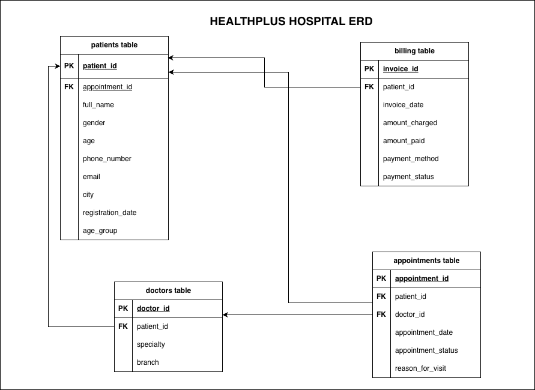

# HealthPlus Hospitals: Patient Data Modernization

HealthPlus Hospitals is a healthcare data-engineering project that uses Python, Pandas, SQLAlchemy, and PostgreSQL to turn inconsistent patient and operational records into clean, standardized, database-ready datasets.

The project represents a hospital network with branches across Nigeria. Data collected independently by different branches contains missing values, duplicate records, inconsistent text and date formats, invalid contact details, and incorrect data types. This project builds a reproducible workflow for correcting those issues and loading the results into a centralized PostgreSQL database for reporting and future analytics.

## Project objectives

- Load and inspect raw healthcare data with Pandas.
- Remove duplicates and handle missing or invalid values.
- Standardize names, categories, phone numbers, emails, and dates.
- Generate identifiers for records with missing primary keys.
- Create useful derived fields such as patient age groups.
- Export cleaned datasets as CSV files.
- Create the PostgreSQL database dynamically from Python.
- Load the cleaned DataFrames into relational database tables.
- Verify that every dataset was loaded successfully.

## Technology stack

- Python
- Pandas and NumPy
- PostgreSQL
- SQLAlchemy
- psycopg2
- python-dotenv
- Jupyter Notebook

## Datasets

| Dataset | Raw rows | Main fields |
| --- | ---: | --- |
| Patients | 1,670 | Patient ID, name, gender, age, phone, email, city, registration date |
| Doctors | 1,500 | Doctor ID, name, specialty, branch |
| Appointments | 1,800 | Appointment ID, patient ID, doctor ID, date, status, reason for visit |
| Billing | 1,700 | Invoice ID, patient ID, invoice date, charges, payments, method, status |

The original files are stored in `data/raw_data/`. The notebook writes transformed files to `data/cleaned_data/`.

## Data pipeline

1. **Ingestion:** Read the four raw CSV datasets into Pandas DataFrames.
2. **Patient cleaning:** Remove duplicates; standardize demographic fields; repair missing IDs; validate ages, phone numbers, and emails; normalize registration dates; and derive age groups.
3. **Appointment cleaning:** Generate missing appointment IDs, handle missing references and statuses, normalize dates, and fill missing visit reasons.
4. **Billing cleaning:** Remove records without required IDs, standardize dates and categories, convert monetary fields to numeric values, and handle missing or negative amounts.
5. **Doctor cleaning:** Generate missing doctor IDs and standardize names, specialties, and branch names.
6. **Export:** Save the cleaned DataFrames as CSV files.
7. **Database integration:** Connect to PostgreSQL, create the configured database when necessary, and load the cleaned data into four tables.
8. **Validation:** Query row counts from PostgreSQL to confirm that the load completed.

## Database model

The PostgreSQL database contains four main tables:

- `patients`
- `doctors`
- `appointments`
- `billing`

Appointments connect patients and doctors through `patient_id` and `doctor_id`. Billing records connect to patients through `patient_id`.



## Repository structure

```text
.
├── data/
│   ├── raw_data/              # Original source CSV files
│   └── cleaned_data/          # CSV files produced by the cleaning workflow
├── docs/
│   ├── erd/                   # Database entity-relationship diagram
│   └── requirements/          # Extracted project requirements
├── notebooks/
│   └── healthplus.ipynb       # End-to-end cleaning and database pipeline
├── .env.example               # PostgreSQL configuration template
├── .gitignore
├── README.md
└── requirements.txt
```

## Getting started

### Prerequisites

- Python 3.10 or later
- PostgreSQL running locally or on a reachable server
- A PostgreSQL user with permission to create databases

### 1. Clone the repository

```bash
git clone https://github.com/esodevops/healthplus-patient-data-modernization.git
cd healthplus-patient-data-modernization
```

### 2. Create and activate a virtual environment

```bash
python -m venv .venv
source .venv/bin/activate
```

On Windows:

```powershell
.venv\Scripts\activate
```

### 3. Install dependencies

```bash
pip install -r requirements.txt
```

### 4. Configure PostgreSQL

Copy the environment template:

```bash
cp .env.example .env
```

Update `.env` with your PostgreSQL settings:

```env
DB_NAME=healthplus_hospitals_db
DB_USER=postgres
DB_PASSWORD=your_password
DB_HOST=localhost
DB_PORT=5432
```

The `.env` file contains credentials and is intentionally excluded from Git.

### 5. Run the pipeline

Open `notebooks/healthplus.ipynb` in Jupyter or VS Code and run the cells from top to bottom. The notebook uses paths relative to the `notebooks/` directory, so run it from its existing location.

The database-creation cell first connects to PostgreSQL's default `postgres` database. It creates `DB_NAME` if that database does not exist, then creates a SQLAlchemy engine for loading the cleaned tables.

## Outputs

After a successful run, the project produces:

- Four cleaned CSV files in `data/cleaned_data/`.
- A PostgreSQL database named by `DB_NAME`.
- `patients`, `doctors`, `appointments`, and `billing` database tables.
- Row-count queries confirming the database load.

## Important behavior

The notebook currently uses `if_exists="replace"` when loading data with `to_sql`. Running the load cells again replaces the existing tables and their contents. Change this to `append` only when intentionally adding new records and after implementing duplicate protection.

## Running SQL Queries

After the database is populated, you can run the provided SQL queries to analyze the data. The `sql/healthplus.sql` file contains queries for:

- Patient statistics (total count, distribution by city, average age)
- Doctor analytics (count by specialty and branch)
- Appointment analysis (status breakdown, common visit reasons)
- Billing reports (total revenue, revenue by payment method)

Execute the SQL script from the terminal:

```bash
psql -h localhost -p 5432 -U postgres -d healthplus_hospitals_db -f sql/healthplus.sql
```

When prompted, enter your PostgreSQL password.

> **Note:** Update the database name (`-d`) and credentials (`-U`) to match your `.env` configuration.

## Project documentation

Detailed business context, table requirements, rationale, and workflow notes are available in [`docs/requirements`](docs/requirements/).
